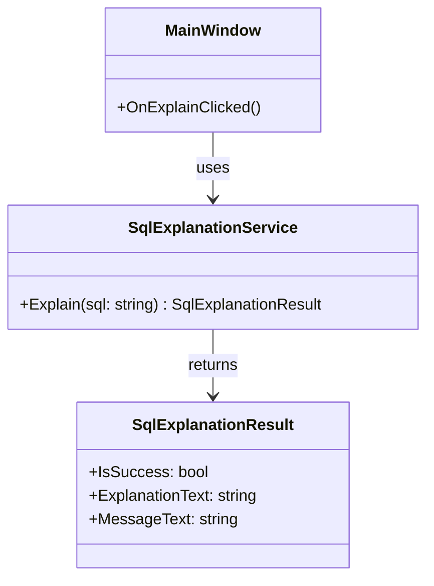

# クラス設計（P3-01 着手）

この文書は、実装前タスク `P3-01: クラス責務定義` の着手版です。  
Phase 2 までに確定したUI仕様（単画面・入力→実行→表示）を前提に、
UI とロジックを分離する最小クラス責務を定義します。

## 1. 設計方針

- 初期実装は 1 画面構成を維持し、クラス数を最小限にする。
- `MainWindow` は表示とイベント仲介に限定し、SQL説明ロジックは保持しない。
- SQL説明の判定・生成は `SqlExplanationService` に集約する。
- UI とサービス間のデータ受け渡しを明確化するため、DTOを1つ導入する。

## 2. クラス一覧（P3-01）

1. `MainWindow`（UI層）
2. `SqlExplanationService`（アプリケーションロジック層）
3. `SqlExplanationResult`（DTO）

## 2-1. クラス図（Mermaid）

責務の関係を把握しやすくするため、P3-01段階の簡易クラス図を定義する。
（※P3-02でI/F詳細が確定したら、必要に応じてメソッド詳細を追記する。）

## 3. 各クラスの責務

### 3-1. `MainWindow`

**責務**
- SQL入力欄、実行ボタン、説明表示欄、メッセージ欄を保持する。
- 実行ボタン押下イベントを受け、入力文字列をサービスへ渡す。
- 返却結果（説明文・メッセージ）をUIへ反映する。

**責務外**
- SQLの構文判定（空入力/未対応/解析不能の具体的ロジック）
- 句別説明文の生成処理

### 3-2. `SqlExplanationService`

**責務**
- 入力SQLを検証し、説明可否を判定する。
- 初期対応範囲（`SELECT` / `FROM` / `WHERE`）の説明文を生成する。
- 空入力、未対応構文、解析不能時の結果を統一形式で返す。

**責務外**
- UIコントロールへの直接アクセス
- 画面表示フォーマット（色・フォント・配置）の制御

### 3-3. `SqlExplanationResult`（DTO）

**責務**
- UIが必要とする最小結果を保持するデータ構造として機能する。
- 説明表示用テキストとメッセージ表示用テキストを保持する。
- 成功/失敗をUIが判定できるフラグを保持する。

**責務外**
- 文字列生成ロジック
- 判定ロジック

## 4. 責務分離の意図

- UI変更（部品配置・文言調整）と、説明ロジック変更（対応句拡張）を独立して修正可能にする。
- `MainWindow` の肥大化を防ぎ、イベント処理の見通しを維持する。
- 将来 `JOIN` 等を拡張する場合でも、主な変更点を `SqlExplanationService` に集中させる。

## 5. P3-01 完了判定に向けた現状

- `MainWindow` / `SqlExplanationService` / DTO の責務境界を明文化済み。
- UI層とロジック層の責務分離方針を記述済み。
- 次タスク（P3-02）で、メソッド単位のI/F（引数・戻り値）を追加定義する。
