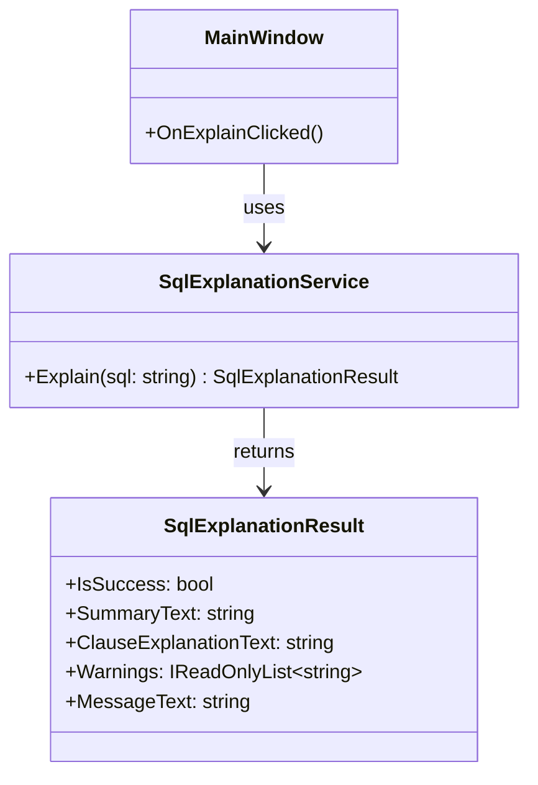

# クラス設計（P3-03 完了 / P4-01 完了）

この文書は、実装前タスク `P3-01: クラス責務定義`、
`P3-02: クラス間I/F定義`、`P3-03: 拡張ポイント最小設計`、`P4-01: クラス設計文書化` の完了内容を含みます。  
Phase 2 までに確定したUI仕様（単画面・入力→実行→表示）を前提に、
UI とロジックを分離する最小クラス責務を定義します。

## 1. 設計方針

- 初期実装は 1 画面構成を維持し、クラス数を最小限にする。
- `MainWindow` は表示とイベント仲介に限定し、SQL説明ロジックは保持しない。
- SQL説明の判定・生成は `SqlExplanationService` に集約する。
- UI とサービス間のデータ受け渡しを明確化するため、DTOを1つ導入する。

## 2. クラス一覧（P3-01）

1. `MainWindow`（UI層）
2. `SqlExplanationService`（アプリケーションロジック層）
3. `SqlExplanationResult`（DTO）

## 2-1. クラス図（Mermaid）

責務の関係とI/Fを把握しやすくするため、P3-02時点のクラス図を定義する。

## 3. 各クラスの責務

### 3-1. `MainWindow`

**責務**
- SQL入力欄、実行ボタン、説明表示欄、メッセージ欄を保持する。
- 実行ボタン押下イベントを受け、入力文字列をサービスへ渡す。
- 返却結果（説明文・メッセージ）をUIへ反映する。

**責務外**
- SQLの構文判定（空入力/未対応/解析不能の具体的ロジック）
- 句別説明文の生成処理

### 3-2. `SqlExplanationService`

**責務**
- 入力SQLを検証し、説明可否を判定する。
- 初期対応範囲（`SELECT` / `FROM` / `WHERE`）の説明文を生成する。
- 空入力、未対応構文、解析不能時の結果を統一形式で返す。

**責務外**
- UIコントロールへの直接アクセス
- 画面表示フォーマット（色・フォント・配置）の制御

### 3-3. `SqlExplanationResult`（DTO）

**責務**
- UIが必要とする最小結果を保持するデータ構造として機能する。
- 説明表示用テキストとメッセージ表示用テキストを保持する。
- 成功/失敗をUIが判定できるフラグを保持する。

**責務外**
- 文字列生成ロジック
- 判定ロジック

## 4. 責務分離の意図

- UI変更（部品配置・文言調整）と、説明ロジック変更（対応句拡張）を独立して修正可能にする。
- `MainWindow` の肥大化を防ぎ、イベント処理の見通しを維持する。
- 将来 `JOIN` 等を拡張する場合でも、主な変更点を `SqlExplanationService` に集中させる。

## 5. P3-01 完了判定に向けた現状

- `MainWindow` / `SqlExplanationService` / DTO の責務境界を明文化済み。
- UI層とロジック層の責務分離方針を記述済み。

## 6. クラス間I/F定義（P3-02）

P3-02の完了条件「メソッド単位で引数/戻り値が記載されている」を満たすため、
UI層とロジック層のI/Fを以下のように定義する。

### 6-1. I/F一覧

| 呼び出し元 | 呼び出し先 | メソッド | 引数 | 戻り値 | 目的 |
|---|---|---|---|---|---|
| `MainWindow` | `SqlExplanationService` | `Explain(string sql)` | `sql`: ユーザー入力SQL | `SqlExplanationResult` | SQLの説明結果を取得する |

### 6-2. `SqlExplanationService.Explain` のI/F詳細

- シグネチャ（想定）  
  `SqlExplanationResult Explain(string sql)`
- 引数
  - `sql` (`string`)
    - 前後空白を含む生入力を受け入れる。
    - `null` は呼び出し側で渡さない前提だが、防御的に空入力相当として扱う。
- 戻り値
  - `SqlExplanationResult`
    - 常に non-null で返す。
    - 成功/失敗に関わらず、UIがそのまま表示判断できる情報を含む。

### 6-3. `SqlExplanationResult` のI/F詳細

UIが必要とする「説明文 + 警告情報」を明確化するため、DTOを以下に統一する。

| プロパティ | 型 | 必須 | 説明 |
|---|---|---|---|
| `IsSuccess` | `bool` | 必須 | 説明生成が成功したかどうか |
| `SummaryText` | `string` | 必須 | 画面上部に表示する要約 |
| `ClauseExplanationText` | `string` | 必須 | 句別説明（SELECT/FROM/WHERE） |
| `Warnings` | `IReadOnlyList<string>` | 必須 | 警告情報の一覧（未対応句・補足） |
| `MessageText` | `string` | 必須 | 状態メッセージ（空入力・解析不能など） |

### 6-4. 応答ルール（UI連携）

- `IsSuccess = true`
  - `SummaryText` と `ClauseExplanationText` を表示する。
  - `Warnings` が1件以上なら、メッセージ欄に警告として箇条書き表示する。
- `IsSuccess = false`
  - `SummaryText` / `ClauseExplanationText` は空文字を許容する。
  - `MessageText` に失敗理由（空入力 / 未対応 / 解析不能）を設定する。

### 6-5. 代表的な入出力例

#### 例1: 正常系（SELECT/FROM/WHERE）

- 入力  
  `SELECT name FROM users WHERE id = 1`
- 出力（概念）
  - `IsSuccess = true`
  - `SummaryText = "users テーブルから id=1 の name を取得するSQLです。"`
  - `ClauseExplanationText` に各句の説明文
  - `Warnings = []`
  - `MessageText = "説明を生成しました。"`

#### 例2: 未対応句を含む（JOIN）

- 入力  
  `SELECT u.name FROM users u JOIN dept d ON ...`
- 出力（概念）
  - `IsSuccess = true`（説明可能な範囲は説明）
  - `Warnings = ["JOIN句は現在未対応のため詳細説明を省略しました。"]`
  - `MessageText = "一部未対応の構文があります。"`

#### 例3: 空入力

- 入力  
  `""`
- 出力（概念）
  - `IsSuccess = false`
  - `MessageText = "SQLを入力してください。"`

## 7. P3-02 着手時点の整理

- メソッド単位のI/F（`Explain` の引数/戻り値）を定義した。
- 出力要件「説明文 + 警告情報」を `SqlExplanationResult` に明示した。
- クラス図のDTOプロパティ表記をI/F定義と整合させた。
- 次タスク（P3-03）で、将来拡張を見据えた最小分割方針を定義する。

## 8. 拡張ポイント最小設計（P3-03）

P3-03では、MVPの単純さを維持しながら、将来の対応句拡張（例: `JOIN`）を
局所変更で追加できる最小分割のみを定義する。

### 8-1. 最小分割方針

- `MainWindow` は引き続き `SqlExplanationService.Explain` のみを呼び出す。
- `SqlExplanationService` 内部を、以下2段の私有メソッドに限定して分割する。
  - 句の抽出: `ExtractClauses(string sql)`
  - 句の説明生成: `BuildClauseExplanation(ExtractedClauses clauses)`
- 公開I/Fは `Explain(string sql)` の1メソッドを維持する。

> 目的: 拡張時にUIや公開I/Fを変更せず、サービス内部だけを差し替え可能にする。

### 8-2. 追加する内部DTO（最小）

`SqlExplanationResult` はUI返却用として維持し、
サービス内部専用に `ExtractedClauses`（内部DTO）を1つだけ追加可能とする。

| 名称 | 想定スコープ | 役割 | 備考 |
|---|---|---|---|
| `ExtractedClauses` | `SqlExplanationService` 内部 | SELECT/FROM/WHERE/JOIN 等の抽出結果を保持 | UI層へは公開しない |

### 8-3. 拡張時の変更境界（例: JOIN対応）

- 変更対象
  - `ExtractClauses` に `JOIN` 抽出ロジックを追加
  - `BuildClauseExplanation` に `JOIN` 説明文生成を追加
- 変更しない対象
  - `MainWindow`
  - `SqlExplanationService.Explain(string sql)` のシグネチャ
  - `SqlExplanationResult` の基本プロパティ構成

### 8-4. 過剰設計を避けるための非採用項目

現時点では以下を採用しない。

- 句ごとの Strategy / Factory などのパターン分割
- 句ごとの独立クラス大量導入
- 汎用ASTや外部SQLパーサ依存の導入

理由: 初期対応範囲（SELECT/FROM/WHERE）には分割コストが過大で、
保守性より複雑性増加の影響が大きいため。

### 8-5. P3-03 完了判定への対応

- 拡張余地: `JOIN` 等の追加変更点をサービス内部に限定できる設計を明示した。
- 最小性: 公開I/FとUI依存を増やさず、内部DTO 1つまでに抑える方針を明示した。
- 非過剰: 高度な設計パターンを非採用とし、MVP相当の単純性を維持した。

## 9. クラス設計文書化（P4-01 完了）

P4-01 の完了条件「クラス一覧、責務、主要メソッド、依存関係、入出力例を文書化」を
満たすため、既存セクションの対応関係を明確化する。

### 9-1. P4-01 要件との対応表

| P4-01 の要求項目 | 本文の対応セクション |
|---|---|
| クラス一覧 | 2章 |
| 責務 | 3章 |
| 主要メソッド | 6章（I/F定義）・8章（内部メソッド方針） |
| 依存関係 | 2-1章（クラス図）・4章（責務分離の意図） |
| 入出力例 | 6-5章 |

### 9-2. 主要メソッド一覧（実装前仕様）

| クラス | メソッド | 公開/非公開 | 役割 |
|---|---|---|---|
| `MainWindow` | `OnExplainClicked()` | 公開（イベントハンドラ） | 入力取得→サービス呼出→UI反映 |
| `SqlExplanationService` | `Explain(string sql)` | 公開 | SQL説明結果を統一DTOで返却 |
| `SqlExplanationService` | `ExtractClauses(string sql)` | 非公開（想定） | 句単位の抽出（拡張ポイント） |
| `SqlExplanationService` | `BuildClauseExplanation(ExtractedClauses clauses)` | 非公開（想定） | 抽出結果から説明文を組み立てる |

### 9-3. 主要メソッドの前提条件/事後条件（pre/post conditions）

| メソッド | 前提条件（Preconditions） | 事後条件（Postconditions） |
|---|---|---|
| `MainWindow.OnExplainClicked()` | 画面初期化済みで `SqlExplanationService` が利用可能である。SQL入力欄は空文字を許容する。 | 入力文字列を `Explain` に1回渡し、返却された `SqlExplanationResult` に基づいて説明欄/メッセージ欄を更新する。未処理例外をUI層外へ伝播させない。 |
| `SqlExplanationService.Explain(string sql)` | `sql` は `null` または文字列を受け入れる。呼び出し側はUI依存情報を渡さない。 | 常に non-null の `SqlExplanationResult` を返す。`IsSuccess=true` の場合は説明表示に必要な文言を返し、`IsSuccess=false` の場合は `MessageText` に失敗理由を設定する。 |
| `SqlExplanationService.ExtractClauses(string sql)` | `Explain` 内部からのみ呼び出す。入力は前処理（trim/null吸収）後のSQL文字列である。 | `ExtractedClauses` を返し、対応句（SELECT/FROM/WHERE）と未対応句の検出結果を保持する。抽出不能時は呼び出し元が失敗結果へ変換可能な状態（空/フラグ）を返す。 |
| `SqlExplanationService.BuildClauseExplanation(ExtractedClauses clauses)` | `clauses` は non-null。`ExtractClauses` の返却形式に準拠している。 | 句別説明文と警告情報（未対応句等）を構築し、`SqlExplanationResult` 組み立てに必要な中間情報を返す。UIレイアウト依存の情報は含めない。 |

## 10. P3-03結果のレビュー観点接続（P4-02 準備）

P4-02 での合否判定に利用できるよう、P3-03 の方針をレビュー観点へ接続する。

### 10-1. レビュー観点マッピング

| P3-03で定義した方針 | P4-02レビュー観点 | 判定質問（Yes/No） |
|---|---|---|
| 公開I/Fを `Explain(string sql)` に固定 | MVP逸脱防止 | 新規機能追加で公開I/Fが増えていないか |
| UIは `MainWindow`、ロジックはサービスに集中 | 責務分離 | UI層にSQL解析ロジックが混入していないか |
| 内部DTOを最小（`ExtractedClauses` 1つ） | 肥大化防止 | 句ごとの不要なクラス分割が増えていないか |
| JOIN拡張は内部メソッド変更で吸収 | 保守性 | 機能追加時に変更範囲がサービス内部へ閉じているか |

### 10-2. P3-03 完了判定

- 追加拡張時の変更境界を明示したため「拡張余地」を満たす。
- 公開I/F固定・内部最小分割により「過剰設計なし」を満たす。
- よって、P3-03 は本ドキュメント上で完了と判定する。
