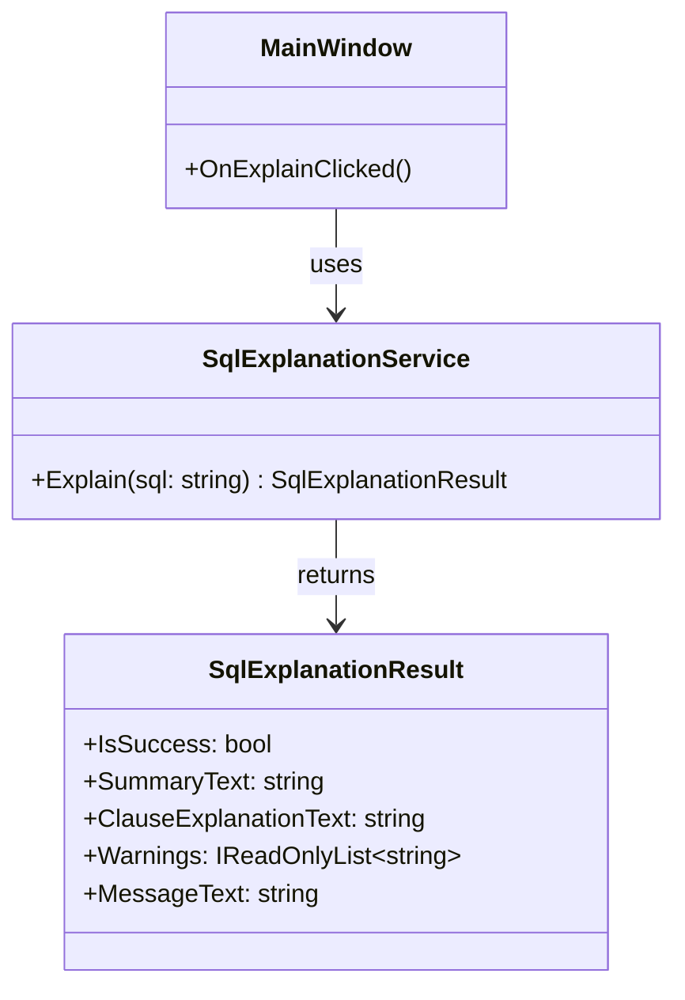

# クラス設計（P3-02 着手）

この文書は、実装前タスク `P3-01: クラス責務定義` と
`P3-02: クラス間I/F定義` の着手版です。  
Phase 2 までに確定したUI仕様（単画面・入力→実行→表示）を前提に、
UI とロジックを分離する最小クラス責務を定義します。

## 1. 設計方針

- 初期実装は 1 画面構成を維持し、クラス数を最小限にする。
- `MainWindow` は表示とイベント仲介に限定し、SQL説明ロジックは保持しない。
- SQL説明の判定・生成は `SqlExplanationService` に集約する。
- UI とサービス間のデータ受け渡しを明確化するため、DTOを1つ導入する。

## 2. クラス一覧（P3-01）

1. `MainWindow`（UI層）
2. `SqlExplanationService`（アプリケーションロジック層）
3. `SqlExplanationResult`（DTO）

## 2-1. クラス図（Mermaid）

責務の関係とI/Fを把握しやすくするため、P3-02時点のクラス図を定義する。

## 3. 各クラスの責務

### 3-1. `MainWindow`

**責務**
- SQL入力欄、実行ボタン、説明表示欄、メッセージ欄を保持する。
- 実行ボタン押下イベントを受け、入力文字列をサービスへ渡す。
- 返却結果（説明文・メッセージ）をUIへ反映する。

**責務外**
- SQLの構文判定（空入力/未対応/解析不能の具体的ロジック）
- 句別説明文の生成処理

### 3-2. `SqlExplanationService`

**責務**
- 入力SQLを検証し、説明可否を判定する。
- 初期対応範囲（`SELECT` / `FROM` / `WHERE`）の説明文を生成する。
- 空入力、未対応構文、解析不能時の結果を統一形式で返す。

**責務外**
- UIコントロールへの直接アクセス
- 画面表示フォーマット（色・フォント・配置）の制御

### 3-3. `SqlExplanationResult`（DTO）

**責務**
- UIが必要とする最小結果を保持するデータ構造として機能する。
- 説明表示用テキストとメッセージ表示用テキストを保持する。
- 成功/失敗をUIが判定できるフラグを保持する。

**責務外**
- 文字列生成ロジック
- 判定ロジック

## 4. 責務分離の意図

- UI変更（部品配置・文言調整）と、説明ロジック変更（対応句拡張）を独立して修正可能にする。
- `MainWindow` の肥大化を防ぎ、イベント処理の見通しを維持する。
- 将来 `JOIN` 等を拡張する場合でも、主な変更点を `SqlExplanationService` に集中させる。

## 5. P3-01 完了判定に向けた現状

- `MainWindow` / `SqlExplanationService` / DTO の責務境界を明文化済み。
- UI層とロジック層の責務分離方針を記述済み。

## 6. クラス間I/F定義（P3-02）

P3-02の完了条件「メソッド単位で引数/戻り値が記載されている」を満たすため、
UI層とロジック層のI/Fを以下のように定義する。

### 6-1. I/F一覧

| 呼び出し元 | 呼び出し先 | メソッド | 引数 | 戻り値 | 目的 |
|---|---|---|---|---|---|
| `MainWindow` | `SqlExplanationService` | `Explain(string sql)` | `sql`: ユーザー入力SQL | `SqlExplanationResult` | SQLの説明結果を取得する |

### 6-2. `SqlExplanationService.Explain` のI/F詳細

- シグネチャ（想定）  
  `SqlExplanationResult Explain(string sql)`
- 引数
  - `sql` (`string`)
    - 前後空白を含む生入力を受け入れる。
    - `null` は呼び出し側で渡さない前提だが、防御的に空入力相当として扱う。
- 戻り値
  - `SqlExplanationResult`
    - 常に non-null で返す。
    - 成功/失敗に関わらず、UIがそのまま表示判断できる情報を含む。

### 6-3. `SqlExplanationResult` のI/F詳細

UIが必要とする「説明文 + 警告情報」を明確化するため、DTOを以下に統一する。

| プロパティ | 型 | 必須 | 説明 |
|---|---|---|---|
| `IsSuccess` | `bool` | 必須 | 説明生成が成功したかどうか |
| `SummaryText` | `string` | 必須 | 画面上部に表示する要約 |
| `ClauseExplanationText` | `string` | 必須 | 句別説明（SELECT/FROM/WHERE） |
| `Warnings` | `IReadOnlyList<string>` | 必須 | 警告情報の一覧（未対応句・補足） |
| `MessageText` | `string` | 必須 | 状態メッセージ（空入力・解析不能など） |

### 6-4. 応答ルール（UI連携）

- `IsSuccess = true`
  - `SummaryText` と `ClauseExplanationText` を表示する。
  - `Warnings` が1件以上なら、メッセージ欄に警告として箇条書き表示する。
- `IsSuccess = false`
  - `SummaryText` / `ClauseExplanationText` は空文字を許容する。
  - `MessageText` に失敗理由（空入力 / 未対応 / 解析不能）を設定する。

### 6-5. 代表的な入出力例

#### 例1: 正常系（SELECT/FROM/WHERE）

- 入力  
  `SELECT name FROM users WHERE id = 1`
- 出力（概念）
  - `IsSuccess = true`
  - `SummaryText = "users テーブルから id=1 の name を取得するSQLです。"`
  - `ClauseExplanationText` に各句の説明文
  - `Warnings = []`
  - `MessageText = "説明を生成しました。"`

#### 例2: 未対応句を含む（JOIN）

- 入力  
  `SELECT u.name FROM users u JOIN dept d ON ...`
- 出力（概念）
  - `IsSuccess = true`（説明可能な範囲は説明）
  - `Warnings = ["JOIN句は現在未対応のため詳細説明を省略しました。"]`
  - `MessageText = "一部未対応の構文があります。"`

#### 例3: 空入力

- 入力  
  `""`
- 出力（概念）
  - `IsSuccess = false`
  - `MessageText = "SQLを入力してください。"`

## 7. P3-02 着手時点の整理

- メソッド単位のI/F（`Explain` の引数/戻り値）を定義した。
- 出力要件「説明文 + 警告情報」を `SqlExplanationResult` に明示した。
- クラス図のDTOプロパティ表記をI/F定義と整合させた。
- 次タスク（P3-03）で、将来拡張を見据えた最小分割方針を定義する。
